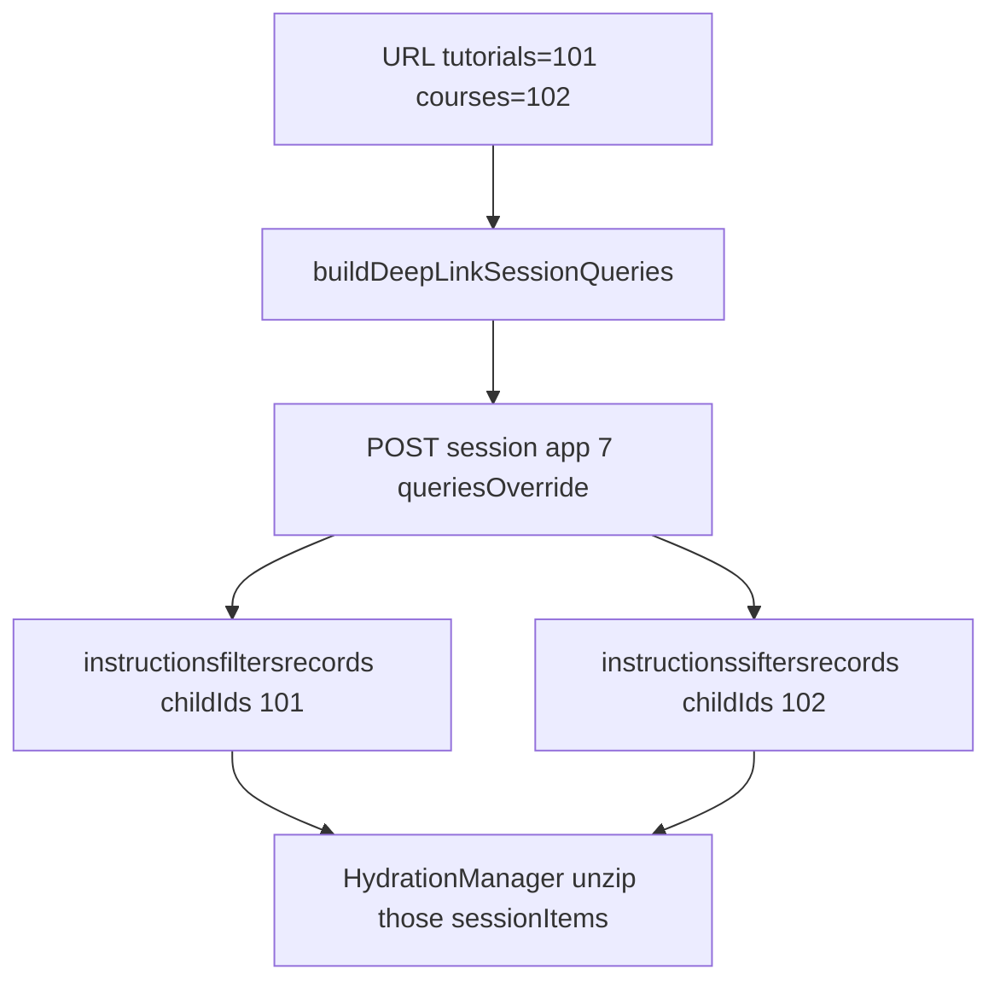

# Drop comms and pin deep-link session queries (videos)

Port [images plan](/Users/fabris/Desktop/images/.cursor/plans/drop_comms_deep-link_queries_eccc7751.plan.md) (already completed there). Same gateway contract: empty `queries` + URL `search` does **not** pin ids. Session first-load defaults never add `childIds`.

Videos already has the fallback path correct. Deep-link Loading does not.

## What is wrong today

In [`src/components/views/Loading.tsx`](src/components/views/Loading.tsx), fallback posts session + `buildFallbackSessionQueries('videos')`. Deep-link still posts **empty `queries`** plus the URL as `search`:

```100:104:src/components/views/Loading.tsx
        : {
            search: resolvedSearch,
            webapp,
            convolution: webapp,
          },
```

`?tutorials=101` in `search` is ignored. `getUnzippedApp` already remaps to session app 7 when unzip flags are on, so the request hits the session endpoint — but without `childIds`.

Contract (from images [`docs/session-first-query-childids.md`](file:///Users/fabris/Desktop/images/docs/session-first-query-childids.md)): send a non-empty `queries` map; omit any route you do not want. **Child-only**: only kinds present in the URL, no `dashboardsinstructionsrecords`. Gateway synthesizes the parent session from `metadata.instructionId`.



Videos difference vs images: there is **no** [`contentPipeline.ts`](file:///Users/fabris/Desktop/images/src/store/thunks/contentPipeline.ts) / `loadPncContent` remount. After Loading, this app navigates to `/media-player`. The only first-load path to wire is Loading. Do not change [`hydrationUtils.ts`](src/library/hydrationUtils.ts) `hydratedThenFetch` — that is a later hydration-leg fetch, not session first-load.

## 1. Deep-link query builder

Copy `buildDeepLinkSessionQueries` from images [`src/library/fallbackSessionQuery.ts`](file:///Users/fabris/Desktop/images/src/library/fallbackSessionQuery.ts) into [`src/library/fallbackSessionQuery.ts`](src/library/fallbackSessionQuery.ts). Keep `buildFallbackSessionQueries` unchanged.

From [`getDeepLinkTreeIds`](src/loadingRouteUtils.ts), emit **only** present kinds:

- `tutorials=101` → `instructionsfiltersrecords` `{ isPrivateView: false, take: 1, skip: 0, childIds: [101] }`
- `courses=102` → `instructionssiftersrecords` same shape, `childIds: [102]`
- `Quizzes=103` → `instructionsdashboardsrecords` same shape, `childIds: [103]`

Do not add `dashboardsinstructionsrecords`. Do not invent missing kinds.

Add `childIds?: number[]` to `Executedquery` in [`src/library/ThunksUtils.ts`](src/library/ThunksUtils.ts). The type currently has `childIDs` (wrong wire name). Keep sending **`childIds`**.

## 2. Wire fetch on Loading

In [`src/components/views/Loading.tsx`](src/components/views/Loading.tsx), the deep-link `fetchData` payload should match images Loading:

- `webapp` / `convolution`: `'session'`
- `requestTake`: `1`
- `queriesOverride`: `buildDeepLinkSessionQueries(getDeepLinkTreeIds(resolvedSearch))`
- `search`: `null` (doc: `search` does not contribute ids)

Allow `search: string | null` on `FetchDataPayload` and `RecordParams` in [`ThunksUtils.ts`](src/library/ThunksUtils.ts). `searchedRoutes` and `counts` are already `null` / `{}`.

Keep unzip flags as they are. [`HydrationManager.ts`](src/store/middleware/HydrationManager.ts) already restricts unzip to URL tree ids — leave that safety net.

Optionally match images and also filter `sessionItems` by URL ids in `validateThenDispatch` before `setSessions`, so Redux is pinned even before unzip.

## 3. Drop `commsSlice`

Nothing reads `state.comms`. Unzip is `sessionItems.quote`.

- Delete [`src/store/slices/commsSlice.ts`](src/store/slices/commsSlice.ts)
- Unregister `comms` in [`src/store/index.ts`](src/store/index.ts) and [`src/store/types.ts`](src/store/types.ts)
- In [`validateThenDispatch`](src/library/ThunksUtils.ts): drop `setIncomings` / `setOutgoings` arms, `isIncomingMessage` / `isOutgoingMessage`, and mailbox types on `FetchedData.content`. Keep the session branches.
- Keep [`src/library/commsUtils.ts`](src/library/commsUtils.ts) — [`CommentRow.tsx`](src/components/views/CommentRow.tsx) still imports `avatars`

Videos has no stale “commsSlice extraReducers” comment on `updateBosses` / `updateUnderbosses` / `updateMinions` in [`actions.ts`](src/library/actions.ts) — skip that images cleanup.

Out of scope: `unzip*Type` settings, incoming/outgoing app indices in `constants.ts` / pagination, studio pager, copying the gateway doc, media-player URL params (`tab`, `ldr`, `videoId`).
